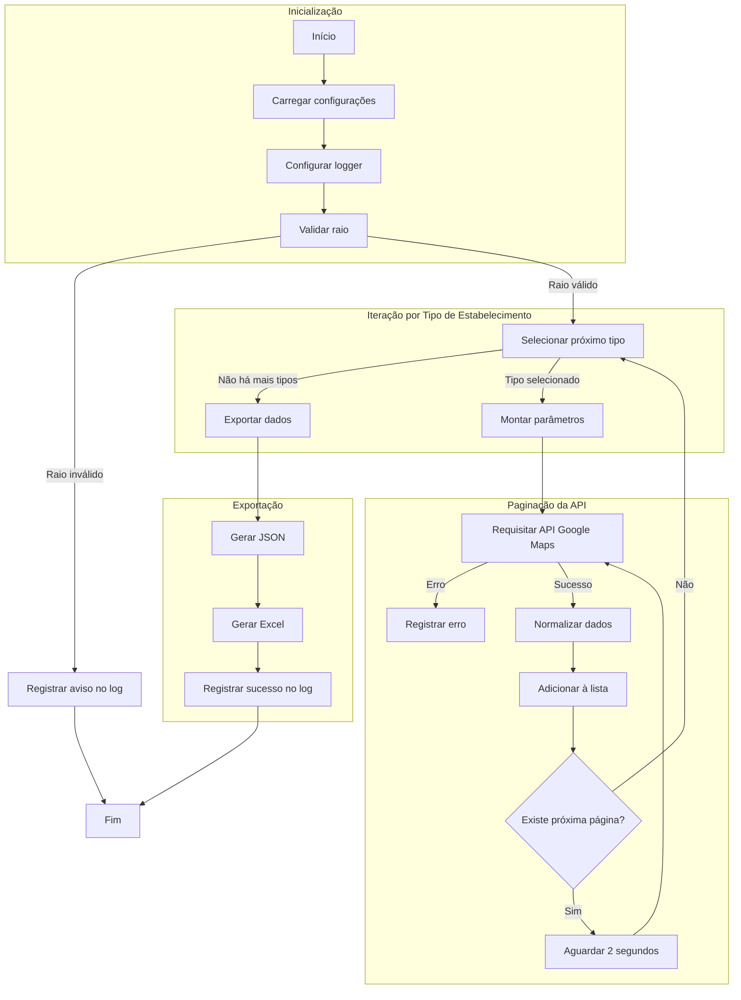

# Automação RPA (Google Maps) – Coleta de Estabelecimentos

Este projeto realiza a automação de buscas no Google Maps utilizando a API
**Google Places Nearby Search**, coletando informações de estabelecimentos
como **academias, restaurantes e sorveterias** a partir de coordenadas
geográficas (latitude e longitude).

Os dados coletados são exportados para:
- Um arquivo **JSON**
- Uma planilha **Excel (.xlsx)**

---

## Visão Geral do Projeto

Segue um diagrama simplificado da arquitetura do projeto:



## Instalação e Configuração

1. Clone o repositório:
   ```bash
   git clone https://github.com/anderdot/rpa-google-maps.git
   ```

2. Acesse o diretório do projeto:
   ```bash
   cd rpa-google-maps
   ```

3. Crie um arquivo `.env` com base no exemplo fornecido:
   ```bash
   cp .env.example .env
   ```

4. Adicione sua **API Key** do Google Maps no arquivo `.env`.
Você pode obter uma chave de API seguindo as instruções na [documentação oficial do Google Maps](https://developers.google.com/maps/documentation/javascript/get-api-key).
obs.: Certifique-se de habilitar o serviço **Places API** para sua chave.

---

## Dependências Necessárias

As dependências externas do projeto estão listadas no arquivo `requirements.txt`:

- `requests` – para requisições HTTP à API do Google Maps
- `openpyxl` – para geração da planilha Excel
- `python-dotenv` – para leitura de variáveis de ambiente

Instalação das dependências:
```bash
pip install -r requirements.txt
```
---

## Configurações e Execução

Para coletar os dados é necessário a passagem de três parâmetros:
- **latitude**: Latitude do ponto central da busca
- **longitude**: Longitude do ponto central da busca
- **raio**: Raio de busca em metros (máximo 50000 metros)

Essas configurações podem ser ajustadas no arquivo `config.py`.

Exemplo de execução do script principal:
```bash
python main.py
```

---

## Estrutura dos Arquivos

- `main.py`: Script principal que executa a coleta de dados.
- `config.py`: Configurações do projeto, incluindo coordenadas e raio de busca.
- `requirements.txt`: Lista de dependências do projeto.
- `.env.example`: Exemplo de arquivo para configuração da API Key.
- `.gitignore`: Arquivo para ignorar arquivos desnecessários no controle de versão.
- `src/automation.py`: Módulo responsável pela lógica de automação e coleta de dados.
- `src/utils/utils.py`: Módulo com funções utilitárias para manipulação de dados, importação e exportação.
- `src/utils/names.py`: Módulo com mapeamento dos diretórios de exportação de arquivos.
- `src/utils/logger.py`: Módulo para configuração de logging.
- `data/`: Diretório onde os arquivos JSON são exportados.
- `exports/`: Diretório onde as planilhas Excel são exportadas.
- `logs/`: Diretório onde os arquivos de log são armazenados.

```bash
automacao-google-maps/
│├── data/
│├── exports/
│├── logs/
│├── src/
││   ├── utils/
││   │   ├── logger.py
││   │   ├── names.py
││   │   └── utils.py
││   ├── __init__.py
││   └── automation.py
│├── .env.example
│├── .gitignore
│├── config.py
│├── main.py
│├── README.md
│└── requirements.txt
```

---

### Considerações Finais

Este projeto é uma solução simples e eficaz para a coleta automatizada de dados de estabelecimentos usando a API do Google Maps (Places Nearby Search).

Durante o desenvolvimento, foram consideradas boas práticas de programação, como modularização do código, tratamento de erros e documentação adequada.

Também foram encontradas melhorias potenciais, como a implementação de testes automatizados e a adição de mais funcionalidades, como:

- Suporte a mais tipos de estabelecimentos
- Execuções agendadas
- Controle de requisições para evitar limites da API
- Alertas por e-mail em caso de falhas
- Utilizar outra API para interface de localização, dispensando o uso de coordenadas geográficas
- Script de limpeza automática dos diretórios de exportação após um período determinado
- Analises e rankeamento dos estabelecimentos coletados com base em avaliações
